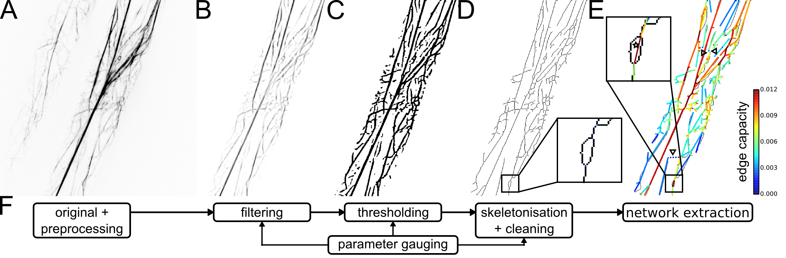

# CytoSeg

**Automated quantification of cytoskeletal networks and cellular transport from image data**

(A) Gray-scale confocal image of two Arabidopsis hypocotyl cells after registration and background subtraction (“original + preprocessing”).
(B) Cytoskeleton image with improved signal-to-noise ratio after cropping of the largest cell and application of tubeness filter (“filtering”).
(C) Binary cytoskeleton image after application of adaptive median threshold (“thresholding”).
(D) Skeletonised cytoskeletal structures after removal of spurious fragments (“skeletonisation + cleaning”).
(E) Overlay of skeleton image and extracted cytoskeletal network with edges colour-coded by their capacity, reflecting the average filament thickness (“network extraction”).
(F) Overview of automated pipeline for extraction of actin cytoskeletal networks from image data. 

Please see [project website for details](http://mathbiol.mpimp-golm.mpg.de/CytoSeg/).

**Instructions**

Preprocessing of actin and Golgi image data:

- Download the Fiji source-code above (fiij.py).
- Open and run the script using Fiji.
- Select the directory containing both actin and Golgi image data and adjust the file names in the script.
- Select the cellular region of interest when asked and confirm selection to proceed.
- The preprocessed images and tracking data are written to the selected directory.

Extraction of actin networks from image data:

- Download the Python source-code above (extraction.py and utils.py).
- Open the extraction script and adjust parameters as needed.
- Run the extraction script using Python (2 or 3).
- Exemplary plots and the computed network properties are written to the selected directory.

**Citation**

If this software is useful for your work, please include the following reference in your publication or redistribution:

Breuer et al. (2017) System-wide organization of actin cytoskeleton determines organelle transport in plant hypocotyl cells. PNAS, 10.1073/pnas.1706711114.

